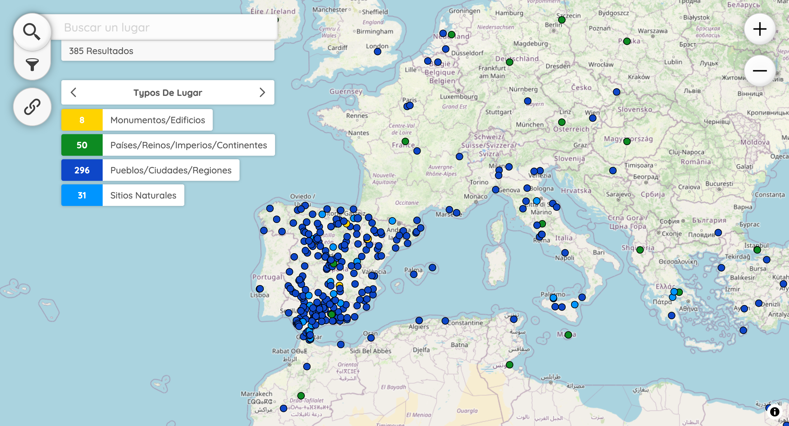

# Peripleo | Desenrollando el cordel

This [map](https://desenrollandoelcordel.github.io/peripleo-pliegos/) is part of the project [Desenrollando el cordel](https://desenrollandoelcordel.unige.ch/inicio.html) (2020-2024). It shows the places mentioned in the collection of Spanish chapbooks held by the Library of the University of Geneva. With this visualisation, users can search places and filter them by dates, printers, places of publication or type of text, for example.

*Peripleo* is a prototype application for the discovery and spatial visualisation of collection data, originally an initiative of the [Pelagios Network](https://pelagios.org/) and developed early in 2022 as part of the British Library's [**Locating a National Collection project**](https://britishlibrary.github.io/locating-a-national-collection/) (LaNC).

## LinkedPlaces Data

Our LP-format is available here: [https://github.com/DesenrollandoElCordel/peripleo-pliegos/blob/main/docs/data/data.json](https://github.com/DesenrollandoElCordel/peripleo-pliegos/blob/main/docs/data/data.json). It follows the model of [MARK16 Dataviz](https://dataviz-mark16.sib.swiss/).

This file was automatically generated from a [.csv file](https://github.com/DesenrollandoElCordel/pliegos-ner/blob/main/moreno-ner/nerList_Moreno_enriched.csv) listing all the occurrences of place names in our corpus. The python script used is available here: [https://github.com/DesenrollandoElCordel/code-python/blob/main/csv2json.py](https://github.com/DesenrollandoElCordel/code-python/blob/main/csv2json.py)

## Code Reuse

Our application is based on the [code](https://github.com/sib-swiss/dh-dataviz) developped by Élisa Nury for MARK16 Dataviz, which is part of the project FNS [MARK16](https://mark16.sib.swiss/).
We adapt the code to change the language to Spanish.

## Installation

See the *Peripleo* instructions for the visualisation of your own geospatial data:
1. the [Installation Guide](https://github.com/britishlibrary/peripleo/blob/main/README.md), and
2. the [Configuration Guide](https://github.com/britishlibrary/peripleo/blob/main/Configuration-Guide.md).
